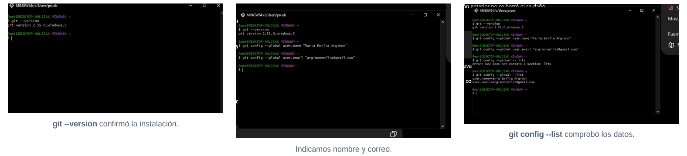
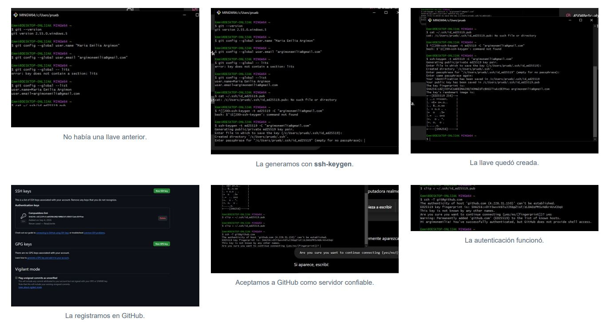
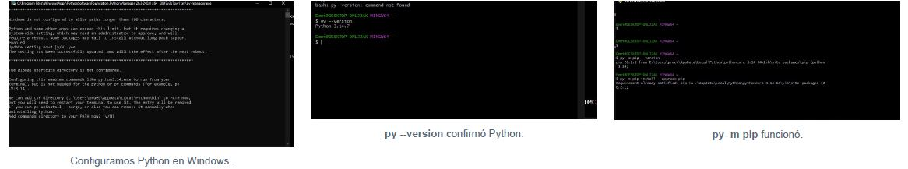
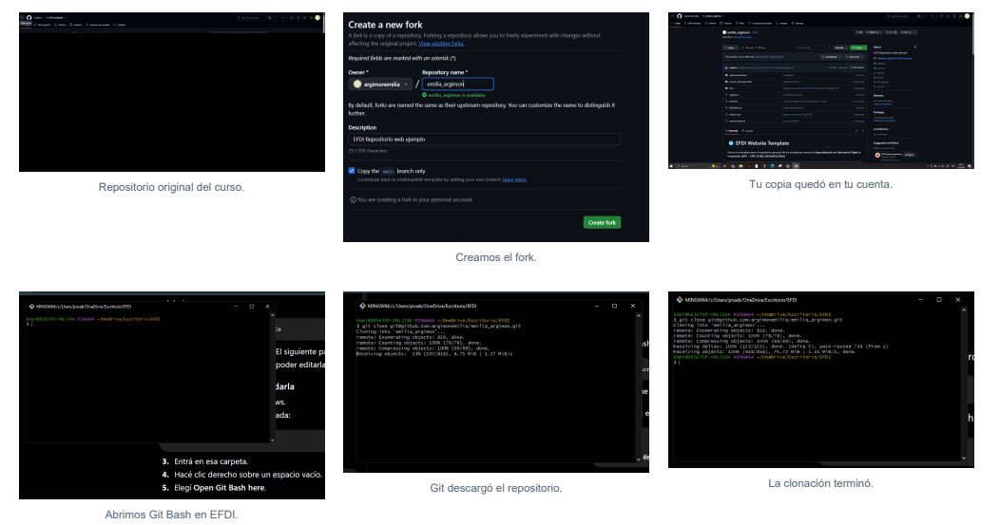
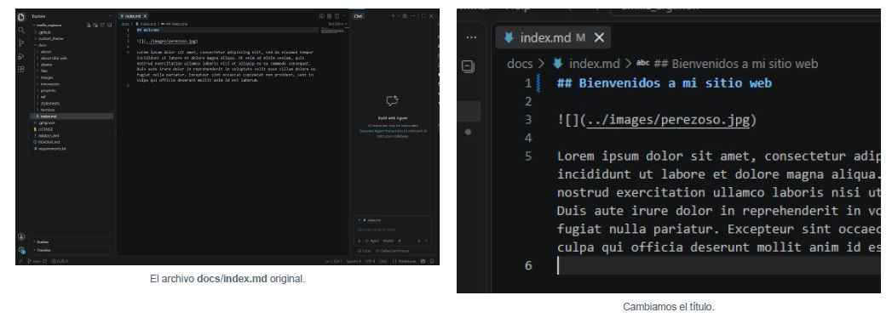
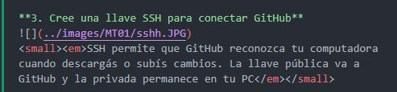
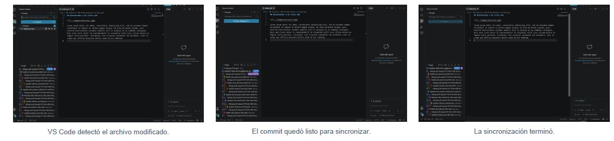
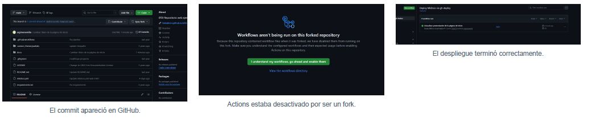
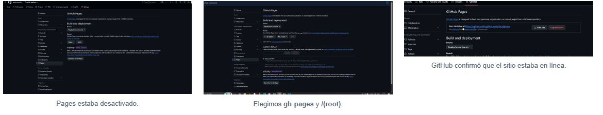
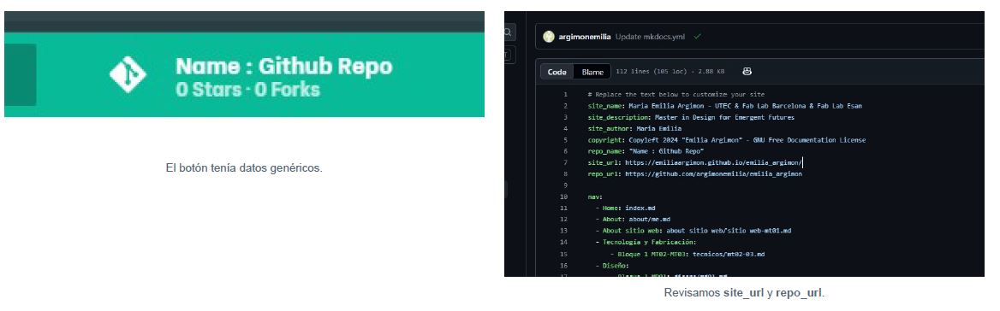

#*MT01*. Construyendo mi espacio digital!
**Del primer commit a mi página web**

En este primer módulo comencé a construir el espacio donde voy a documentar mi recorrido durante el posgrado. El desafío no era solamente crear una página web, sino también aprender a organizar la información, registrar el proceso y darle una identidad propia.
Entre instalaciones, comandos, decisiones visuales y algunos errores difíciles de descifrar, la página fue tomando forma.

<small><em>Edición y previsualización local de mi página web durante las primeras etapas del proyecto. </em></small>

**Mapa de Recorrido**

<small><em>Imgen representativa del proceso realizado durante el MT01 creada con ia </em></small>

**Punto de partida**

El objetivo era crear un repositorio y una página web personal como una "bitacora de procesos". Al comenzar tenía muchas dudas e incertidumbres, ya que casi no he tenido experiencia con el area de la programacion,comandos y paginas web. 
Mi primer desafío fue entender cuales eran las herramientas, cómo se relacionaban y que podía hacer con cada una. Al principio parecían elementos independientes, pero poco a poco fui comprendiendo que cada una cumplía una función dentro del mismo sistema.

Les adjunto un pdf con <a href="https://drive.google.com/file/d/190Xl5ZQK-6tV62VCoun3beRZGXf3MLF5/view?usp=sharing" target="_blank" rel="noopener noreferrer">mis apuntes</a>, quizas le pueda servir a alguien para comprender mejor las herramientas y como se relacionan.

**Preparando las herramientas**

Antes de comenzar a construir la página, instalé y configuré las herramientas necesarias para editar, visualizar, guardar y publicar el proyecto.

<u>Tabla de Herramientas</u>

<small><em>Hice esta tabla para recordar para que se utiliza cada herrammienta</em></small>

 
En esta etapa explico una parte del proceso de instalacion de las herramientas digitales y el desarrollo de pagina web, indicando los conceptos y partes que considere mas importantes del proceso.

**1. Instalamos Git en Windows**
Git es el programa que registra las versiones de los archivos y permite sincronizarlas con GitHub.

!!! danger "Error"

    Instalé Git pero no me funcionaba nada de lo que intentaba hacer, ni siquiera el primer paso. Esto ocurrió al momento de instalarlo ya que seleccioné aceptar todo con “Next”. Luego entendí que algo estaba mal, así que decidí desinstalarlo y volverlo a instalar.

    Allí verifiqué cada paso hasta encontrar el error que había cometido anteriormente. Una vez instalado nuevamente, comencé con los primeros pasos.

**2. Comprobe Git y configure mi identidad**

Primero utilicé el comando `git --version` para comprobar que Git se hubiera instalado correctamente. Luego configuré mi nombre y correo electrónico, datos que permiten identificar quién realiza cada cambio dentro del proyecto.

Finalmente, con `git config --global --list`, verifiqué que la información hubiera quedado guardada correctamente.

**3. Cree una llave SSH para conectar GitHub**

<small><em>SSH permite que GitHub reconozca tu computadora cuando descargás o subís cambios. La llave pública va a GitHub y la privada permanece en tu PC</em></small>

Para conectar mi computadora con GitHub utilicé una clave SSH. Primero comprobé si ya existía una y, al confirmar que no había ninguna, generé una nueva mediante la terminal.

Registré la clave pública en mi cuenta de GitHub y realicé una prueba de autenticación. Al aceptar GitHub como servidor confiable, la conexión quedó establecida correctamente.

!!! danger "Error"

    Al intentar visualizar la clave pública, la terminal indicó que el archivo no existía. Revisé la ruta y corregí el comando. Luego pude copiar la clave, registrarla en GitHub y comprobar que la autenticación funcionaba correctamente.

**4.Instale Python y comprobamos pip**

<small><em>py -m pip install mkdocs: instala MkDocs.</small><em>

**5. Cree un fork y clonamos el repositorio**

 Para comenzar a trabajar sobre la página, primero realicé un fork del repositorio original del curso. Esto creó una copia dentro de mi cuenta de GitHub que podía modificar sin alterar el proyecto original.

**6.Comencé a editar la página en Visual Studio Code, utilizando Markdown para organizar el contenido y MkDocs para visualizar los cambios en el navegador**

Aquí comenzó el desafío de diseñar la página y cargar su contenido. Mientras incorporaba la información, también buscaba la manera de presentarla de forma más atractiva: probé cuadros, diferentes tamaños de texto, negritas e imágenes que ayudaran a explicar cada etapa.

Esta parte me llevó bastante tiempo porque, como diseñadora, no podía concentrarme solamente en el contenido. Necesitaba que la página también fuera estética, ordenada y fácil de leer. Por eso, cada avance estuvo acompañado de nuevas pruebas y ajustes en la forma de comunicar la información.

**7.Cree un commit y sincronice con GitHub y GitHub Pages**

<small><em>Guardar actualizar el archivo local (Ctrl + S). Commit registra una versión con un mensaje. Sync Changes envía la versión a GitHub y trae cambios remotos.</em></small>

<small><em>Verifique el cambio y habilite GitHub Actions</em></small>

<small><em>Actions guarda la web construida en la rama gh-pages. GitHub Pages publica esos archivos en Internet. El botón Visit site abre la página.</em></small>

**Revise repositorio**

!!! danger "Error"

    **¿Por qué no funcionaba?**

    El botón todavía mostraba la información genérica de la plantilla y no estaba correctamente vinculado con mi repositorio. Revisé el archivo `mkdocs.yml` y corregí `repo_url` con la dirección de mi repositorio en GitHub. También verifiqué `site_url`, donde se indica la dirección pública de la página web. Luego de guardar y actualizar los cambios, el enlace comenzó a funcionar correctamente.

!!! info "Resumen"

    Este primer módulo fue un recorrido de aprendizaje, prueba y error. Al comenzar tenía muy poca experiencia con programación, comandos y creación de páginas web, por lo que uno de mis principales aprendizajes fue comprender cómo se relacionan las diferentes herramientas utilizadas.
    Cometí varios errores con la instalación, los comandos, las rutas de las imágenes y la configuración, pero cada uno me permitió entender mejor las herramientas. Lo que más tiempo me llevó fue organizar el contenido y darle una estética clara y personal. Para resolver mis dudas utilicé ChatGPT, pidiéndole que me explicara cada error, cómo solucionarlo y por qué debía hacerlo de esa manera.

