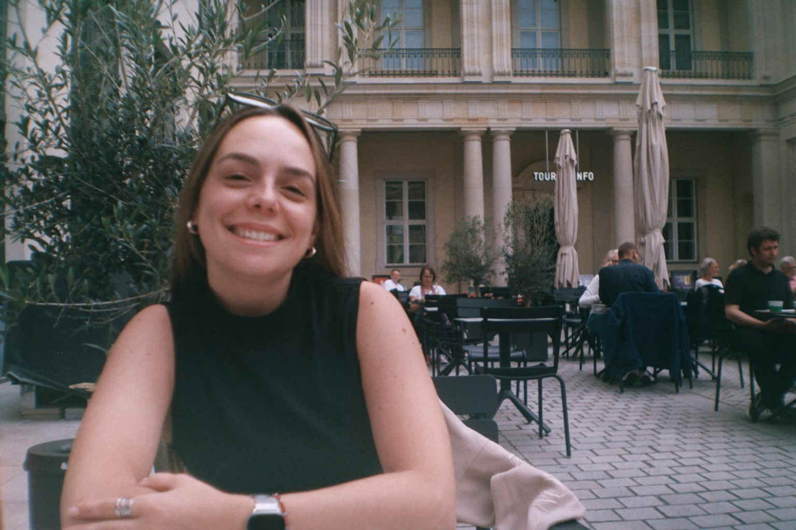
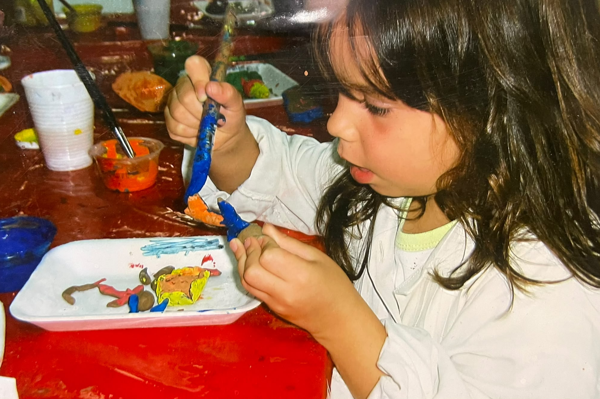
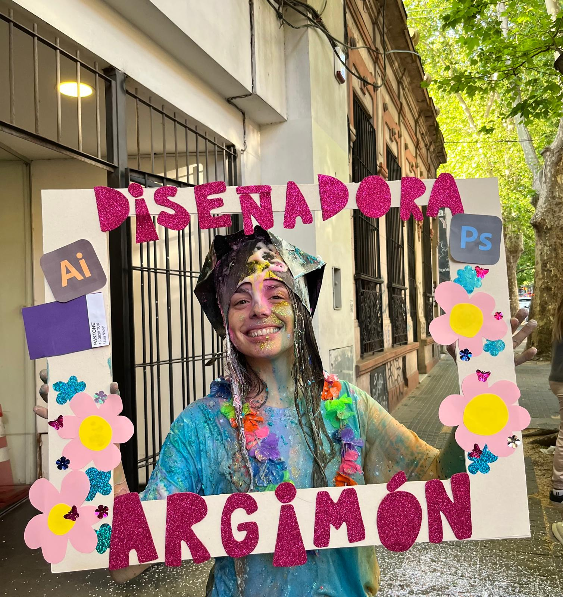
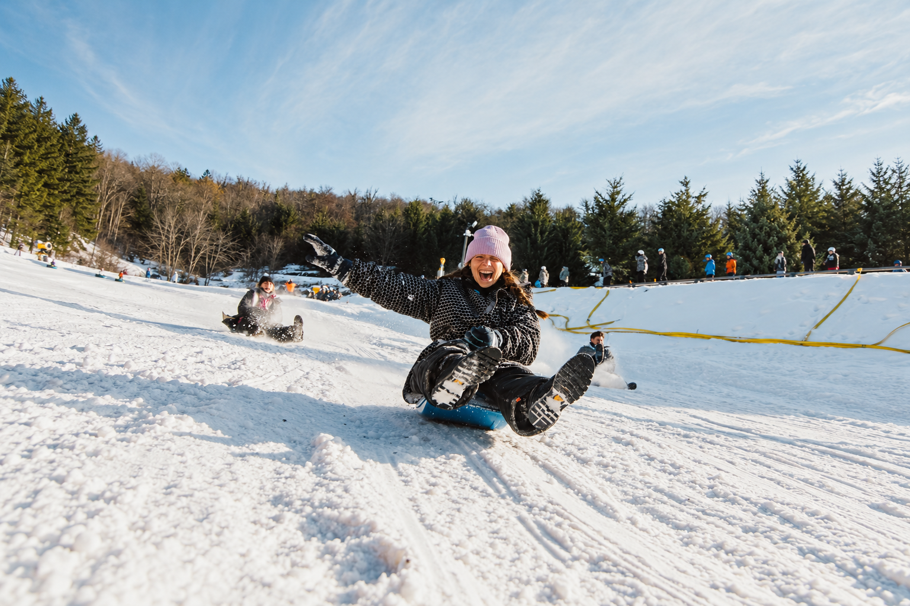

# ¡Hola! Soy Emilia.

Me presento: Soy diseñadora industrial, curiosa y amante de empezar cosas nuevas, aunque después me pregunte: “¿Para qué me metí en esto?”. Eso de volver a sentir que no tengo idea de lo que estoy haciendo también tiene su lado lindo.
Me gusta planificar y soy muy organizada, pero ser de Libra no siempre colabora con la parte de tomar decisiones.
Disfruto viajar, conocer nuevos lugares y generar nuevas experiencias. Me encanta aprender cosas nuevas de los demás, descubrir otras formas de hacer las cosas y embarcarme en proyectos diferentes. Porque sí, soy disciplinada, pero una rutina demasiado quieta no es lo mío.

<h2>Crear antes de saber qué era diseñar</h2>

Desde chica disfrutaba mucho hacer cosas con las manos. Pintaba, hacía manualidades, inventaba juegos, cualquier cosa con tal de no aburrirme. Podía pasar tardes enteras creando algo, aunque todavía no supiera bien qué estaba haciendo ni para qué iba a servir.
Recuerdo con mucho cariño las tardes de invierno con mi abuela, sentadas en el piso, rodeadas de pinturas, dibujos y materiales. 
En ese momento yo lo entendía simplemente como jugar, crear y compartir. Mirándolo ahora, creo que el diseño ya estaba presente en mi vida, aunque todavía no supiera ponerle ese nombre.

<h2>De “quiero crear cosas” a diseñadora industrial</h2>

A los 15 años ya decía que quería ser diseñadora industrial. ¿Sabía explicar exactamente qué hacía una diseñadora industrial? No. Pero tenía algo bastante claro: quería crear cosas y, si además podían ayudar o hacer algo por o para las personas, mucho mejor.
Ese camino me llevó a estudiar en la Facultad de Arquitectura, Diseño y Urbanismo de la Universidad de la República. Allí me formé en la Escuela Universitaria Centro de Diseño y me recibí como licenciada en Diseño Industrial, perfil Producto.
Así, casi sin darme cuenta, aquella niña que pasaba las tardes pintando en el piso encontró una profesión en la que podía seguir creando, investigando y aprendiendo.

<h2>Diseñar también es animarse</h2>

Entiendo el diseño como una herramienta para abordar problemas a través del análisis, buscando soluciones equilibradas que contemplen las necesidades de las partes involucradas.
Me interesa comprender cada situación antes de proponer una respuesta: observar cómo las personas se relacionan con un producto, detectar qué está funcionando y qué no, investigar las alternativas existentes y probar diferentes posibilidades.
Disfruto planificar cada detalle, aunque también aprendí que ningún proceso sale exactamente como uno espera. A veces hay que ajustar, cambiar de dirección, volver a probar o simplemente dejarse llevar por la pendiente. 

 Bienvenidos a este nuevo viaje!!

